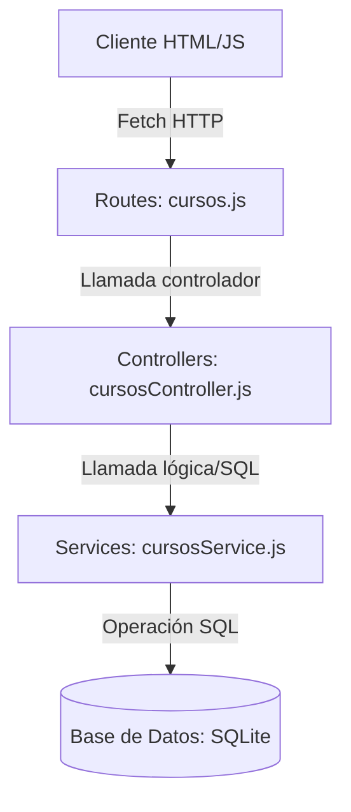

# Diseño Técnico: Gestión de Cursos

Este documento detalla las decisiones técnicas adoptadas para cumplir con la **Definition of Done** y los requisitos de arquitectura del proyecto.

---

## 1. Arquitectura del Backend (Capa de Negocio)

La lógica de negocio se estructurará en tres capas diferenciadas con responsabilidad única:



### Capas:
1. **Ruta (`src/routes/cursos.js`):**
   * Define los endpoints `GET /api/cursos` y `POST /api/cursos`.
   * Vincula las solicitudes a las funciones controladoras.
   * Contiene la documentación Swagger OpenAPI para su visibilidad en `/docs`.
2. **Controlador (`src/controllers/cursosController.js`):**
   * Extrae los parámetros de la petición HTTP (`req.body`).
   * Realiza validaciones estrictas de datos de entrada.
   * Retorna códigos HTTP correspondientes:
     * `201` al crear exitosamente.
     * `400` para datos inválidos (vacíos o formato incorrecto).
     * `500` para capturar errores de base de datos o fallos del servidor.
3. **Servicio (`src/services/cursosService.js`):**
   * Interactúa con la conexión de base de datos de [db.js](file:///c:/Users/vicen/OneDrive/Escritorio/nombre/backend-sala-de-estudios/src/db.js).
   * Ejecuta sentencias preparadas de SQL para la persistencia.

---

## 2. Base de Datos

Se creará una nueva tabla en la base de datos `datos.db` a través del script de inicialización en [db.js](file:///c:/Users/vicen/OneDrive/Escritorio/nombre/backend-sala-de-estudios/src/db.js):

```sql
CREATE TABLE IF NOT EXISTS cursos (
  id INTEGER PRIMARY KEY AUTOINCREMENT,
  nombre TEXT NOT NULL,
  instructor TEXT NOT NULL,
  creditos INTEGER NOT NULL
);
```

---

## 3. Integración en Express y Servido del Frontend

* Se habilitará el middleware de archivos estáticos en [index.js](file:///c:/Users/vicen/OneDrive/Escritorio/nombre/backend-sala-de-estudios/src/index.js):
  ```javascript
  app.use(express.static('public'));
  ```
* Esto servirá los archivos de la interfaz web (`index.html`, `style.css`, `app.js`) directamente en la raíz `/` de la aplicación Express, compartiendo el mismo puerto (`3000`).

---

## 4. Diseño del Frontend (Tailwind CSS)

* **Estructura HTML:** Semántica completa utilizando maquetación responsiva con el framework **Tailwind CSS** (cargado mediante CDN para no depender de compiladores adicionales).
* **Alineación Visual (Aesthetic):**
  * Uso de clases y componentes con estilos predefinidos modernos y elegantes.
  * Paleta de colores basada en una estética oscura (fondo Slate/Zinc con gradientes índigo/violeta y acentos vibrantes).
  * Estructura visual con bordes suaves, efectos de elevación/sombra (`shadow-2xl`), desenfoques translúcidos y transiciones fluidas de hover.
  * Tipografía moderna de Google Fonts (Inter) integrada a través de las clases nativas de Tailwind CSS.
* **Lógica JS (Fetch):**
  * Carga asíncrona mediante `fetch('/api/cursos')`.
  * Envío asíncrono y adición al listado del DOM local sin recarga de página ante respuesta exitosa (`201`).
  * Captura de errores de red (e.g. caída de servidor) mediante bloque `try...catch` en la petición `fetch`, mostrando de inmediato un panel de alerta visible al usuario.
